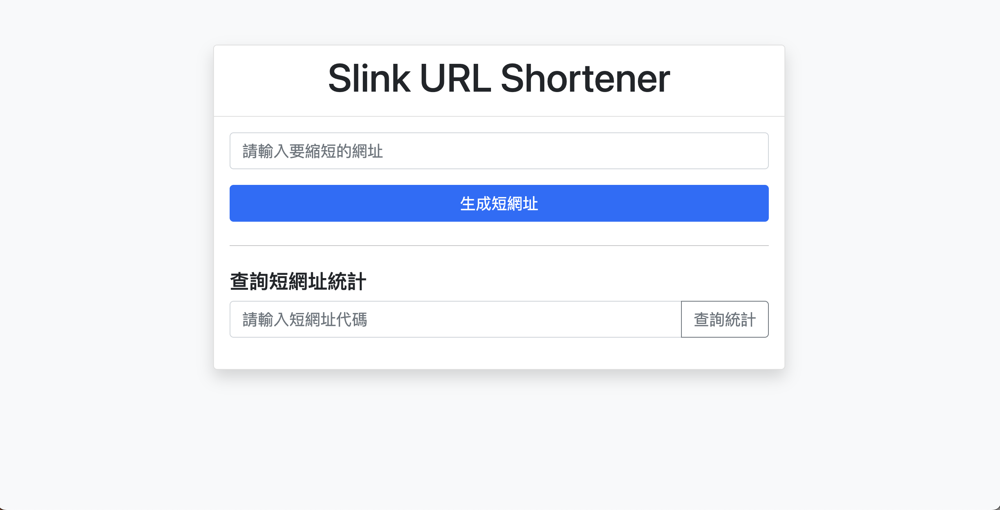
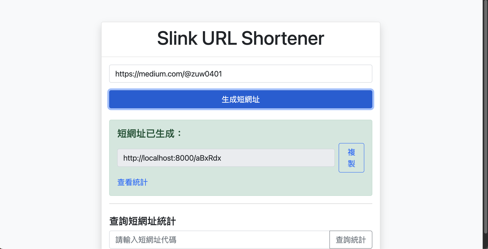
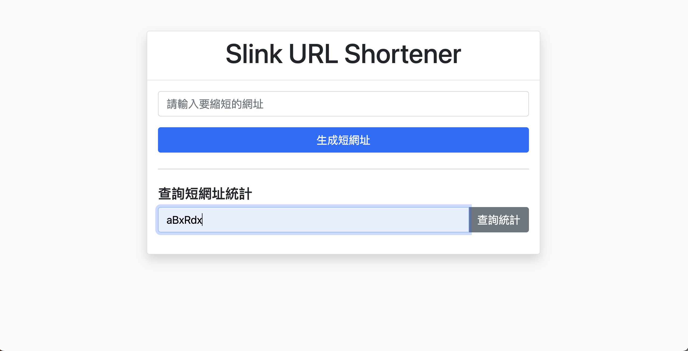
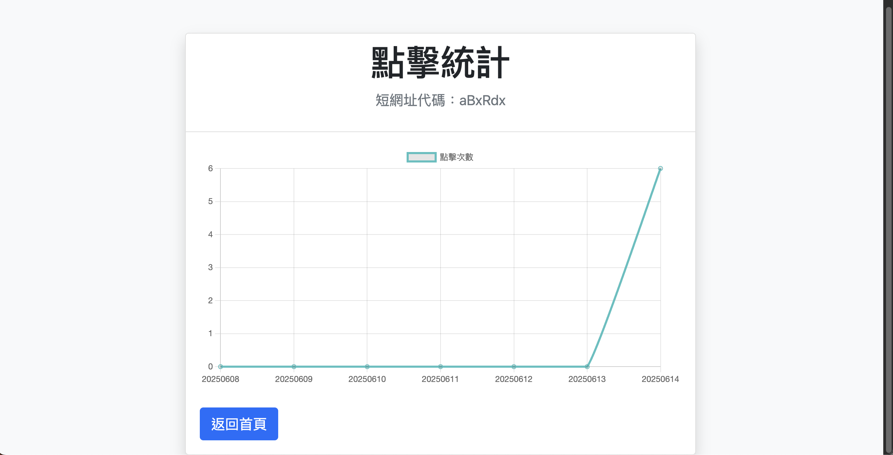

# Slink - URL Shortener

一個基於 FastAPI 的 URL 縮短服務，具有以下功能：

- URL 縮短（同一網址不重複產生短碼，過期後才會產生新短碼）
- 點擊統計（含圖表展示）
- URL 格式驗證
- 自動過期機制
- Redis 快取支持
- Docker 一鍵部署
- 前端頁面可查詢短網址統計

## 專案架構與技術棧
- **後端**：FastAPI
- **資料庫**：PostgreSQL
- **快取**：Redis
- **前端**：Jinja2 + Bootstrap + Chart.js
- **容器化**：Docker, docker-compose

## 專案結構說明
```
app/
  ├── main.py                # FastAPI 主程式，路由與啟動點
  ├── db/
  │     ├── models.py        # SQLAlchemy 資料表定義
  │     └── session.py       # 資料庫連線設定
  ├── services/
  │     ├── shortener.py     # 短網址產生與查詢邏輯
  │     └── validator.py     # URL 格式驗證
  ├── cache/
  │     └── redis.py         # Redis 快取與點擊統計
  ├── static/
  │     └── css/style.css    # 前端樣式
  └── templates/
        ├── index.html       # 首頁（短網址產生、查詢統計）
        └── stats.html       # 統計頁面（點擊圖表）
docker-compose.yml           # Docker 多服務設定
Dockerfile                   # FastAPI 應用 Docker 化
requirements.txt             # Python 套件需求
.env.example                 # 環境變數範例
```

## 環境變數說明
- `DATABASE_URL`：PostgreSQL 連線字串
- `REDIS_URL`：Redis 連線字串
- `SECRET_KEY`：短碼加密用 salt
- `BASE_URL`：產生短網址時的主機位址

## 安裝與啟動

### Docker 快速啟動
1. 安裝 Docker Desktop
2. 複製 `.env.example` 為 `.env` 並填入參數
3. 執行：
   ```bash
   docker compose up --build -d
   ```
4. 開啟 [http://localhost:8000](http://localhost:8000)

### 手動啟動（開發用）
1. 克隆專案
2. 安裝依賴：
   ```bash
   pip install -r requirements.txt
   ```
3. 設置環境變數（複製 .env.example 到 .env 並修改）
4. 運行服務：
   ```bash
   uvicorn app.main:app --reload
   ```

## API 與前端操作說明
- 首頁可輸入原始網址產生短網址
- 可直接輸入短碼查詢統計
- `/stats/{short_code}` 可查看點擊圖表
- API 端點：
  - POST /shorten - 創建短網址
  - GET /{short_code} - 重定向到原始網址
  - GET /stats/{short_code} - 獲取點擊統計

## 常見問題
- **短網址會重複嗎？**  
  不會，系統會檢查未過期的短網址，已存在則直接回傳。
- **過期資料怎麼處理？**  
  系統查詢時自動判斷過期，若需清理可加排程腳本。
- **點擊統計怎麼算？**  
  每次短網址被訪問時會自動累加，並以圖表顯示最近 7 天數據。

## 維護建議
- 可定期清理過期資料（如需）
- 若需擴充 API 或前端，建議遵循現有結構









