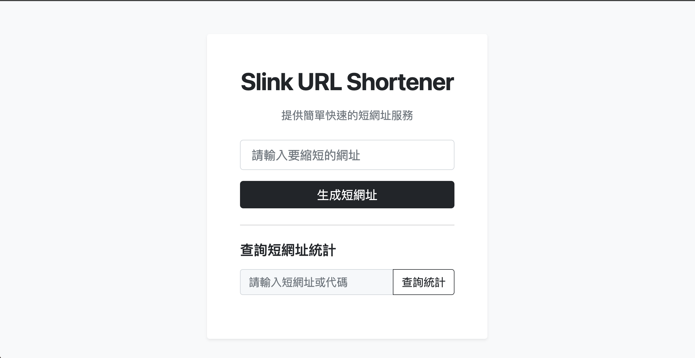
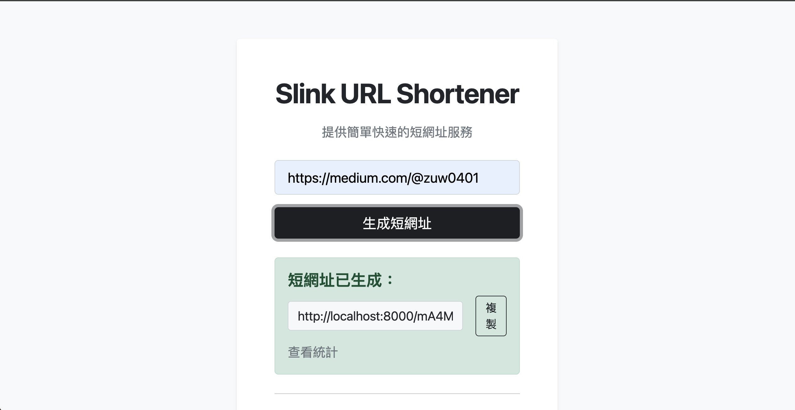
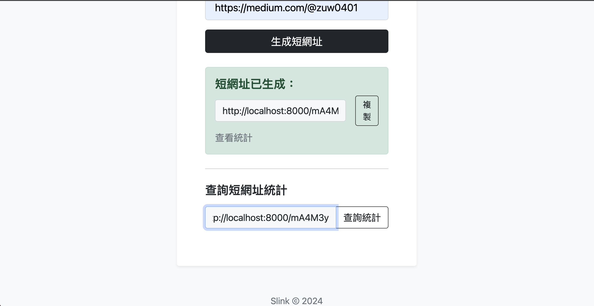
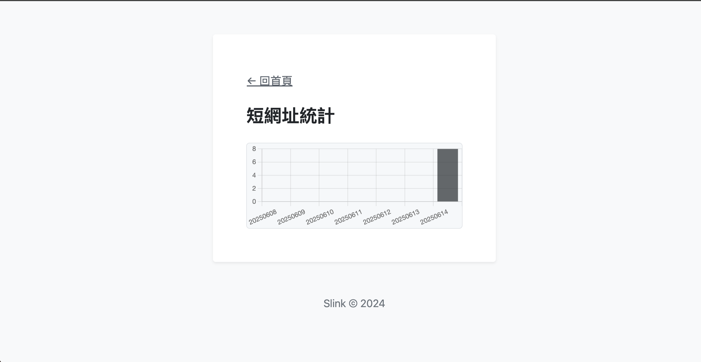

# Slink

Slink 是一個使用 FastAPI、PostgreSQL、Redis 建置的短網址服務專案。  
專案目的是練習後端分層設計、資料持久化、Redis 快取 / 事件佇列，以及 Docker Compose 開發環境。

## 技術棧

- FastAPI
- Pydantic
- SQLAlchemy Async
- PostgreSQL
- Redis
- Docker / Docker Compose
- pytest（repo 內含 tests 結構）

## 專案架構

- `app/router/`：HTTP 路由
- `app/controllers/`：Controller 層，處理輸入輸出與錯誤轉換
- `app/services/`：商業邏輯（短網址建立 / 解析）
- `app/db/`：資料模型與 repository
- `app/cache/`：Redis client 與 URL cache
- `app/core/`：設定、依賴注入、lifespan、stats queue
- `tests/`：測試檔案

## 可確認功能

- `POST /api/shorten`：建立短網址
- `GET /api/resolve/{short_code}`：查詢原始網址
- `GET /api/stats/{short_code}`：讀取每日點擊統計
- `GET /{short_code}`：瀏覽器 redirect
- Redis URL mapping cache
- Redis click event queue / daily stats hash
- Docker Compose 啟動 app / postgres / redis

## 執行方式

### Docker Compose
```bash
docker compose up --build
```
## 本機開發
```bash
uvicorn app.main:app --reload
```

## 設計重點
Router / Controller / Service / Repository 分層
FastAPI Depends 做依賴注入
Redis 同時用於快取與統計事件緩衝
PostgreSQL 儲存短網址資料
lifespan 啟動時初始化資源與背景任務

## 已知限制 / 下一步
目前 short code 生成仍使用 Python 內建 hash，後續應改為穩定 hash 演算法
目前點擊事件雖先進入 queue，但仍會立即觸發處理；後續可再進一步完全背景化
cache TTL 應進一步與 URL 實際到期時間對齊
is_active 與 click_count 欄位可再與實際流程整合

## 畫面預覽





