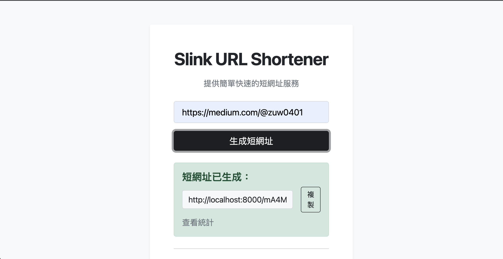

# Slink - 現代化 FastAPI URL 短網址服務

Slink 是一個基於 **FastAPI + SQLAlchemy (async) + Redis** 的現代化短網址服務，支援高效縮短、快取、點擊統計、異步處理與前後端分離（SPA）。

## 主要功能
- 短網址產生（同一網址不重複產生短碼，過期後才會產生新短碼）
- 點擊統計（支援近 7 天圖表展示，Chart.js）
- URL 格式與安全性驗證（Google Safe Browsing，可選）
- Redis 快取與統計累積
- 完整異步支援（async/await）
- Docker 一鍵部署
- 前端單頁應用（SPA，Bootstrap 風格）
- 高覆蓋率自動化測試（pytest, pytest-asyncio, httpx）

## 技術棧
- **後端**：FastAPI, SQLAlchemy (async), PostgreSQL, Redis
- **前端**：單一 app.html + app.js（SPA，Bootstrap, Chart.js）
- **測試**：pytest, pytest-asyncio, httpx
- **容器化**：Docker, docker-compose

## 專案結構
```
app/
  ├── main.py                # FastAPI 主程式（lifespan 啟動/關閉，SPA 路由）
  ├── db/                    # 資料庫模型與 session 管理
  ├── services/              # 短網址、統計、驗證等服務
  ├── cache/                 # Redis 快取與統計
  ├── static/
  │     ├── css/style.css    # 前端樣式
  │     └── js/app.js        # SPA 前端邏輯
  └── templates/app.html     # SPA 單頁模板

Dockerfile                  # FastAPI 應用 Docker 化
requirements.txt            # Python 套件需求
.env                        # 環境變數
README.md                   # 專案說明

tests/                      # 測試（API、服務單元測試）
```

## 環境變數（.env）
- `DATABASE_URL`：PostgreSQL 連線字串
- `TEST_DATABASE_URL`：測試用資料庫連線字串
- `REDIS_URL`：Redis 連線字串
- `SECRET_KEY`：短碼加密用 salt
- `BASE_URL`：產生短網址時的主機位址
- 其他參數見 `.env` 範例

## 安裝與啟動

### Docker 快速啟動
1. 安裝 Docker Desktop
2. 複製 `.env.example` 為 `.env` 並填入參數
3. 執行：
   ```bash
   docker compose up --build -d
   ```
4. 開啟 [http://localhost:8000](http://localhost:8000)

### 手動啟動（開發用）
1. 克隆專案
2. 安裝依賴：
   ```bash
   pip install -r requirements.txt
   ```
3. 設置環境變數（複製 .env.example 到 .env 並修改）
4. 運行服務：
   ```bash
   uvicorn app.main:app --reload
   ```

## API 與前端操作
- 首頁（SPA）可產生短網址、查詢統計
- `/api/shorten`：POST，產生短網址
- `/api/resolve/{short_code}`：GET，還原原始網址
- `/api/stats/{short_code}`：GET，取得點擊統計
- `/{short_code}`：瀏覽器直接重定向
- `/stats/{short_code}`：統計圖表頁

## 自動化測試
- 測試目錄：`tests/`
- 支援 async/await、依賴注入覆寫、mock DB/Redis
- 執行測試：
  ```bash
  docker compose exec app env PYTHONPATH=/app pytest --cov=app --cov-report=term-missing
  ```
- 覆蓋率高，涵蓋 API、服務、異常路徑

## 最佳實踐
- 完全以 `.env` 控制環境變數，程式碼無敏感資訊
- FastAPI lifespan handler 管理啟動/關閉
- Redis/DB 依賴皆可 mock，測試穩定
- 前後端分離，SPA 體驗佳

## 畫面預覽




